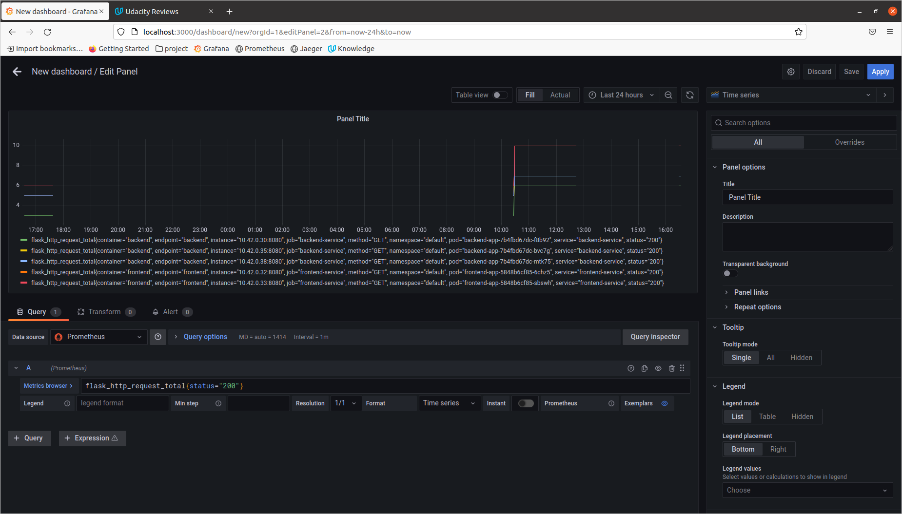

**Note:** For the screenshots, you can store all of your answer images in the `answer-img` directory.

## Verify the monitoring installation

Run `kubectl` command to show the running pods and services for all components. Take a screenshot of the output and include it here to verify the installation


## Setup the Jaeger and Prometheus source
Expose Grafana to the internet and then setup Prometheus as a data source. Provide a screenshot of the home page after logging into Grafana.


## Create a Basic Dashboard
Create a dashboard in Grafana that shows Prometheus as a source. Take a screenshot and include it here.


## Describe SLO/SLI
Describe, in your own words, what the SLIs are, based on an SLO of *monthly uptime* and *request response time*.
The service level is the degree (i.e. level) of performance that an application (or service) provides to the user.
* SLI -> It is known as Service Level Indicator, a specific metric used to measure the performance of a service. For example, cpu usage, memory usage, error rate, uptime
* SLO -> It is known as Service Level Objective, a target value or range of values for a service level that is measured by an SLI. For example, 99% uptime and 95% of the request return is in 50 milliseconds in next month.  
A natural structure for SLOs is thus SLI ≤ target, or lower bound ≤ SLI ≤ upper bound. 

## Creating SLI metrics.
It is important to know why we want to measure certain metrics for our customer. Describe in detail 5 metrics to measure these SLIs. 
* request latency -> how long it takes to return a response to a request
* availability/uptime -> the fraction of the time that a service is usable
* system throughput -> how many units of information a system can process in a given amount of time
* error rate -> the frequency of errors
* traffic -> The amount of stress on a system from demand

## Create a Dashboard to measure our SLIs
Create a dashboard to measure the uptime of the frontend and backend services We will also want to measure to measure 40x and 50x errors. Create a dashboard that show these values over a 24 hour period and take a screenshot.


## Tracing our Flask App
We will create a Jaeger span to measure the processes on the backend. Once you fill in the span, provide a screenshot of it here.
```python
# jaeger
def config_tracer():
    config = Config(
           config = {
                'sampler': {
                'type': 'const',
                'param': 1,
            },
            'logging': True,
        },
        service_name="service_backend",
        validate=True,
        metrics_factory=PrometheusMetricsFactory(service_name_label="service_backend")
    )
    return config.initialize_tracer()


app = Flask(__name__)
metrics = GunicornInternalPrometheusMetrics(app)
CORS(app)

jaeger_tracer = config_tracer()
tracing = FlaskTracing(jaeger_tracer, True, app)
```


## Jaeger in Dashboards
Now that the trace is running, let's add the metric to our current Grafana dashboard. Once this is completed, provide a screenshot of it here.


## Report Error
Using the template below, write a trouble ticket for the developers, to explain the errors that you are seeing (400, 500, latency) and to let them know the file that is causing the issue.

TROUBLE TICKET

Name: `POST` to `/star` throw `500` error

Date: 12-11-2021 at 17:57

Subject: Can't POST to the /star endpoint 

Affected Area: `"./reference-app/backend/app/app.py", line 61`

Severity: High

Description: `TypeError:'NoneType' object is not subscriptable`


## Creating SLIs and SLOs
We want to create an SLO guaranteeing that our application has a 99.95% uptime per month. Name three SLIs that you would use to measure the success of this SLO.
* Uptime > 99.9%
* latency < 50ms
* error rate < 0.3%
* CPU and Memory usage is moderate

## Building KPIs for our plan
Now that we have our SLIs and SLOs, create KPIs to accurately measure these metrics. We will make a dashboard for this, but first write them down here.
* Uptime ->
  + Amount of time the application is live
  + It is very important to have an application with high uptime, so that user will not face problem
  + It includes the uptime of Front-end, Back-end and Trial uptime
* Latency ->
  + The time it takes for a request to be served by an application, often measured in millisecond
  + It is very important to keep track of successful and fail(error) response to requests
* Error rate ->
  + Number of HTTP error caused by application to total number of HTTP response
  + We need to ensure the application has a very low error rate
* CPU and Memory usage ->
  + Amount of CPU and Memory used by the application
  + We need to ensure CPU or Memory usage not more than 75%, otherwise it can have bad impact on the application 

## Final Dashboard
Create a Dashboard containing graphs that capture all the metrics of your KPIs and adequately representing your SLIs and SLOs. Include a screenshot of the dashboard here, and write a text description of what graphs are represented in the dashboard.
* CPU usage
* Memory usage
* Average CPU saturation
* Error rate


## Beautiful Dashboard
Some dashboards that're looking good

